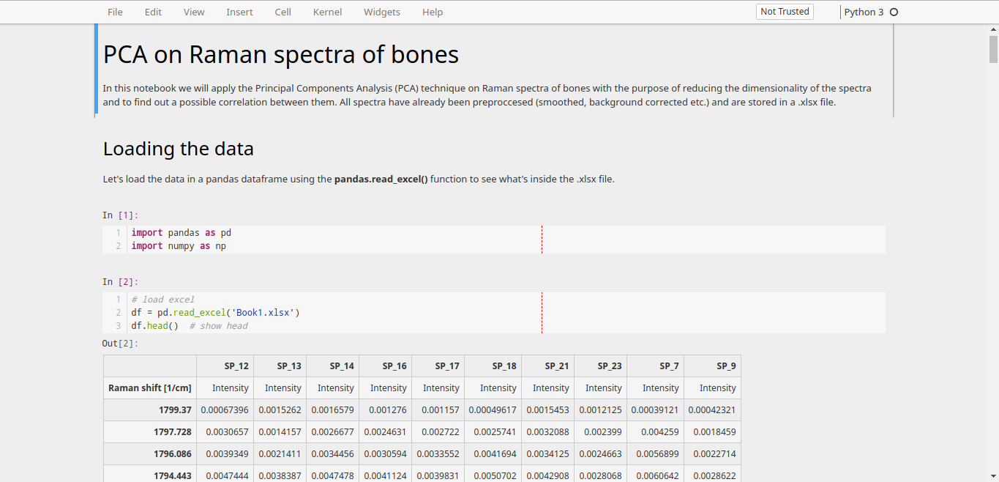

# jupyter-notebook-theme

A custom light Jupyter Notebook theme based on [aahoo's](https://gist.github.com/aahoo/e8ed425759711ead1ef7e7a3332dcd2d) "Github Flavored Theme for Ipython/Jupyter Notebook".

## Usage

Place `custom.css` in `~/.jupyter/custom`.

## Screenshot

